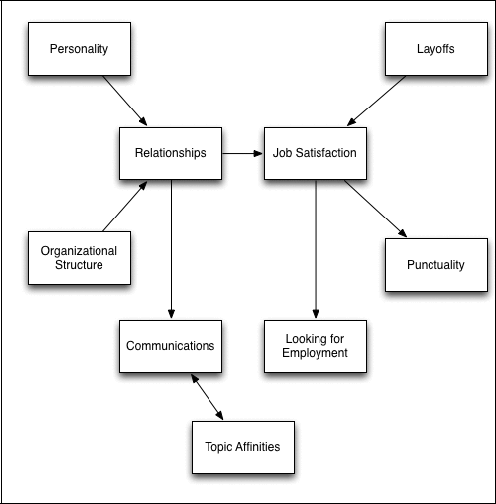

### Author Ronald Johnson on risk calculations using cybersecurity data. 

We will look at the risks faced by organizations and employees. 

Sample Threat Scenario
“A member of a group decimated by layoffs suffers a drop in job satisfaction. Angry at the company, the employee uploads documents to Dropbox, planning to use them for personal gain.”
This scenario would result in a number of observables in the generated data:
Data streams end for laid-off co-workers, and they disappear from the LDAP directory.
As evidenced by logon and logoff times, subject becomes less punctual because of a drop in job satisfaction.
HTTP logs show document uploads by subject to Drop-box.

Using data from a IEEE data generation set.
J. Glasser and B. Lindauer, "Bridging the Gap: A Pragmatic Approach to Generating Insider Threat Data," 2013 IEEE Security and Privacy Workshops, San Francisco, CA, USA, 2013, pp. 98-104, doi: 10.1109/SPW.2013.37. keywords: {Testing;Social network services;Organizations;Topology;Generators;Data privacy;Data models;Insider Threat;Synthetic Data;Modeling and Simulation},

We will apply some different models for running through our data. 
Supervised Learning: Best when labeled insider/non-insider data is available; useful for classification.
Unsupervised Learning: Detects anomalies without labels; valuable for spotting new, unseen threats.
Sequential / Time-Series Models: Capture temporal trends in behavior, such as shifts in login or access patterns.
Graph-Based Models: Model relationships between users, systems, and data; powerful for spotting unusual access paths.
Hybrid & Ensemble Approaches: Combine multiple methods for improved detection and fewer false positives.

| **Model Family**             | **Typical Models**                                                               | **Inputs**                                             | **Strengths**                                          | **Weaknesses**                                    | **Use Cases**                                      |
| ---------------------------- | -------------------------------------------------------------------------------- | ------------------------------------------------------ | ------------------------------------------------------ | ------------------------------------------------- | -------------------------------------------------- |
| **Supervised Learning**      | Logistic Regression, SVM, Random Forests, Gradient Boosting, Neural Networks     | Labeled insider vs. normal behavior, activity logs     | Clear decision boundaries, interpretable in some cases | Needs labeled data, imbalance issues              | Classifying insider vs. non-insider                |
| **Unsupervised Learning**    | k-Means, DBSCAN, Autoencoders, Isolation Forest, PCA                             | Unlabeled logs, access patterns, peer comparisons      | Good for scarce labels, detects novel threats          | High false positives if poorly tuned              | Detecting anomalous file access or downloads       |
| **Sequential / Time-Series** | Hidden Markov Models, LSTM, GRU, Hawkes Processes                                | Time-stamped logs, sequences of actions, login times   | Captures temporal patterns, evolving behavior          | Data-hungry, computationally heavy                | Modeling shifts in login times, activity bursts    |
| **Graph-Based**              | Graph Neural Networks, Community Detection, Graph-based Anomaly Scoring          | User-resource interaction graphs, access control lists | Understands structural relationships in org networks   | Complex setup, needs graph construction           | Detecting unusual access paths outside peer groups |
| **Hybrid & Ensemble**        | Supervised + Unsupervised Ensembles, Rule-based + ML Hybrids, Bayesian Inference | Combination of logs, rules, features, graph signals    | Reduces false positives, leverages multiple data views | Integration complexity, model management overhead | Operational SOC use, balancing accuracy vs. alerts |
